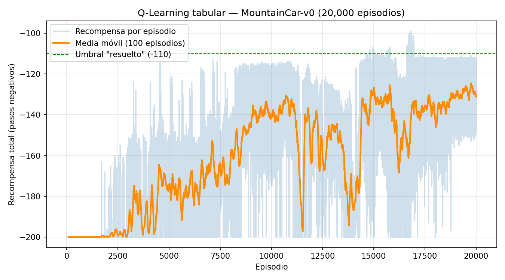
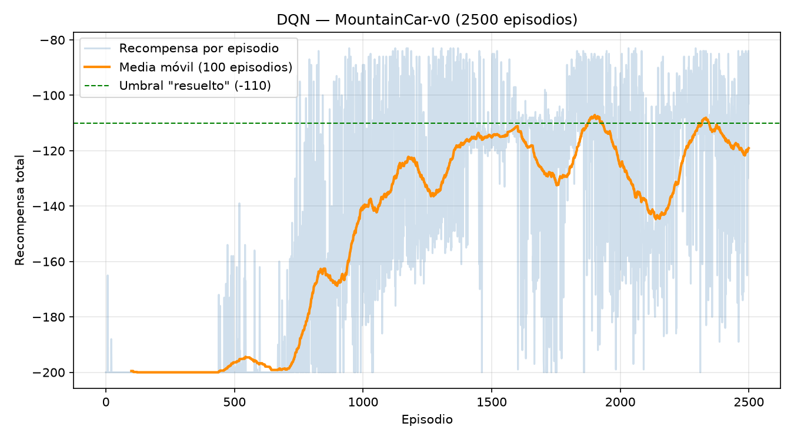

A hands-on repo for understanding how Reinforcement Learning works.
Train, inspect, and visualise RL agents on [MountainCar-v0](https://gymnasium.farama.org/environments/classic_control/mountain_car/) (or any other Gymnasium environment).

**This repo is a set of exercises.** The CLI, training loops and persistence are
written; the algorithms themselves are left as marked `EXERCISE` stubs for you
to fill in. Start with **[EXERCISES.md](EXERCISES.md)**.

## MountainCar-v0 environment

An under-powered car sits in a valley. Its engine is too weak to drive straight
up the right-hand hill, so the only way out is to rock back and forth and build
up momentum. The goal is to reach the flag at position `0.5`.

### State (observation) — 2 continuous values

| Index | Variable | Description | Range |
|:---:|---|---|---|
| 0 | position | Position of the car along the x-axis | -1.2 to 0.6 |
| 1 | velocity | Velocity of the car | -0.07 to 0.07 |

### Actions — 3 discrete

| Value | Action |
|:---:|---|
| 0 | Accelerate to the left |
| 1 | Don't accelerate |
| 2 | Accelerate to the right |

### Rewards

| Event | Reward |
|---|---|
| Every step taken | **-1** |
| Reaching the flag (position >= 0.5) | episode ends |

The reward is `-1` per step and nothing else, so the total return is simply the
negative of the episode length: **less negative is better**. Episodes are cut
off after 200 steps, which gives a floor of `-200` for a policy that never
reaches the flag. Anything around `-110` or better is considered solved.

This flat reward is what makes MountainCar interesting: there is no gradient to
follow toward the goal, so the agent has to stumble onto the flag by
exploration before it can learn anything at all.

## Install

```bash
uv sync
```

## Usage

All commands are exposed through the `mountaincar` CLI:

```bash
uv run mountaincar <command>
```

| Command | What it does |
|---|---|
| `version` | Show the package version |
| `list` | List the agents and whether each has a save file |
| `inspect` | Print the state/action spaces and some random transitions |
| `init <agent>` | Create a new, untrained agent and save it |
| `train <agent>` | Train an agent (resumes from its save if one exists) |
| `load <agent>` | Print a saved agent's info, optionally evaluate it |
| `sim <agent>` | Play episodes with a trained agent, printed step by step |
| `render <agent>` | Play episodes in a graphical window |
| `delete <agent>` | Delete an agent's save file |

`<agent>` is either `qlearning` or `dqn`.

### Example session

```bash
# See what the environment looks like
uv run mountaincar inspect --steps 3

# Train the tabular agent
uv run mountaincar train qlearning --episodes 10000

# How did it do?
uv run mountaincar load qlearning --eval

# Watch it drive
uv run mountaincar render qlearning --episodes 3
```

## Agents

Both agents live in `src/mountain_car/agents/` and are written from scratch
(no Stable-Baselines3 or similar), so every part of the algorithm is visible --
and, in this repo, **partly left for you to write**. See [EXERCISES.md](EXERCISES.md).

### `qlearning` — tabular Q-Learning

The observation is only 2-dimensional and the environment publishes hard bounds
for both dimensions, so the state space is discretised into an
`n_bins x n_bins` grid (400 states by default) and stored in a plain Q-table.

Defaults: `n_bins=20`, `lr=0.1`, `gamma=0.99`, epsilon `1.0 -> 0.01` decaying by
`0.9995` per episode. A correct implementation scores about `-133` and reaches
the flag in 100/100 episodes, after roughly 20k episodes (~4 min).

### `dqn` — Deep Q-Network

A small MLP on the raw 2-D observation, trained with experience replay and a
target network. A correct implementation scores about `-106` and reaches the
flag in 100/100 episodes, after roughly 2500 episodes (~5 min on CPU) -- better
than the tabular agent, and past the conventional "solved" threshold of `-110`.

Getting there takes more than transcribing the DQN pseudocode. MountainCar has
a reward structure that defeats the textbook version of the algorithm, and
Exercise 3 is about finding out how and why. That exercise ships with a ladder
of progressive clues, so it is a guided investigation rather than a wall.

> A note on hardware: none of this needs a GPU. The network is tiny and the
> batches are small, so a gradient step costs about 0.5 ms on CPU and the
> bottleneck is stepping the environment, not matrix multiplication. On a GPU
> this would most likely be *slower*, because per-kernel launch overhead would
> dominate work this small.

## Project layout

```
src/mountain_car/
├── cli.py              # argparse CLI, one command per function
└── agents/
    ├── qlearning.py    # tabular Q-Learning
    └── dqn.py          # DQN: QNetwork, ReplayBuffer, DQNAgent
saves/                  # agent save files land here
results/                # curvas de entrenamiento y CSVs generados (Taller 1)
scripts/
└── train_and_plot.py   # entrena, guarda CSV y grafica la curva de aprendizaje
EXERCISES.md            # the exercises: what to implement, in what order
```

---

## Taller 1 — Q-Learning vs. DQN en MountainCar-v0

Este fork completa los tres ejercicios de `EXERCISES.md` sobre el repositorio
base del curso, y añade un script (`scripts/train_and_plot.py`) para producir
las curvas de entrenamiento y los CSV de evidencia que se muestran abajo.

### Cómo reproducir los resultados

```bash
uv sync

# Q-Learning tabular (≈1–2 min en CPU)
uv run python scripts/train_and_plot.py qlearning --episodes 20000

# DQN (≈5 min en CPU)
uv run python scripts/train_and_plot.py dqn --episodes 2500
```

Cada corrida deja un CSV (`results/<agente>_rewards.csv`) y una gráfica
(`results/<agente>_training_curve.png`) con la curva de recompensa por
episodio y su media móvil.

### 1. Q-Learning tabular — Ejercicio 1

**Discretización:** cada dimensión continua (posición, velocidad) se divide
en 20 bins usando los límites que publica el propio entorno
(`env.observation_space.low/high`), dando una rejilla de 400 estados posibles.

**Actualización TD (Ejercicio 1c):**

```
target   = reward                              si terminated
target   = reward + gamma * max_a' Q(s', a')   en otro caso
Q(s,a)  += lr * (target - Q(s,a))
```

**Hiperparámetros:** `n_bins=20`, `lr=0.1`, `gamma=0.99`,
`epsilon: 1.0 → 0.01` con decaimiento `0.9995` por episodio, 20 000 episodios.

**Resultado real obtenido (evaluación greedy, 100 episodios, seeds fijas):**

| Métrica | Valor |
|---|---|
| Recompensa media (últimos 1000 episodios de entrenamiento) | **-129.1** |
| Recompensa media en evaluación (100 episodios, política greedy) | **-129.5** |
| Mejor episodio individual | **-99** |
| Episodios en los que llega a la meta | **100/100** |
| Estados de la tabla Q visitados | 297 / 400 |
| Tiempo de entrenamiento (CPU, este equipo) | ~81 s |



La curva muestra el patrón típico de Q-Learning tabular: recompensa plana en
`-200` mientras `epsilon` es alto (exploración pura, el agente casi nunca
llega a la meta), y una mejora progresiva a medida que `epsilon` decae y la
tabla Q converge, estabilizándose alrededor de `-130`.

### 2. DQN — Ejercicios 2 y 3

**Red neuronal (Ejercicio 2a):** MLP `state_dim(2) → 128 → 128 → action_dim(3)`
con ReLU en las capas ocultas y sin activación en la salida (los Q-values son
negativos, no probabilidades).

**Paso de aprendizaje (Ejercicio 2b):** Bellman con red objetivo (target network)
congelada:

```
current_q = Q_online(s).gather(1, a)
next_q    = max_a' Q_target(s')          # sin gradiente
target_q  = r + gamma * next_q * (1 - terminated)
loss      = MSE(current_q, target_q)
```

**Ejercicio 3 — por qué DQN "textbook" no aprende nada en MountainCar:**
con epsilon-greedy estándar, cada paso de exploración elige una acción
aleatoria **independiente** de la anterior. Para escapar del valle el auto
necesita empujar en la misma dirección durante ~20 pasos seguidos; la
probabilidad de que eso ocurra por azar puro es `(1/3)^20 ≈ 3×10⁻¹⁰`. En
consecuencia, el agente nunca observa la recompensa terminal y la red
converge a predecir el mismo valor (`-1/(1-γ) ≈ -100`) para las tres acciones
en todo estado: ha aprendido correctamente que, con los datos que ve, nada
que haga cambia el resultado.

**Solución implementada — exploración "pegajosa" (sticky exploration):** en
lugar de sortear una acción aleatoria nueva en cada paso, la acción
exploratoria se repite con probabilidad `sticky_prob=0.9` (nuevo
hiperparámetro, persistido en `_HPARAMS`) y solo se redibuja el resto de las
veces. Esto correlaciona las acciones consecutivas y genera corridas
sostenidas en una misma dirección — justo el patrón de "balanceo" que el auto
necesita para tomar impulso. El estado (`_last_explore_action`) se reinicia al
comienzo de cada episodio de entrenamiento.

**Hiperparámetros:** `lr=1e-3`, `gamma=0.99`, `epsilon: 1.0 → 0.01` con
decaimiento `0.995`, `batch_size=64`, `target_update_freq=10` episodios,
`sticky_prob=0.9`, ~2500 episodios.

**Resultado real obtenido (evaluación greedy, 100 episodios, seeds fijas):**

| Métrica | Valor |
|---|---|
| Recompensa media (evaluación, 100 episodios, política greedy) | **-112.39** |
| Mejor episodio individual | **-86.00** |
| Episodios en los que llega a la meta | **100/100** |
| Tamaño del replay buffer al final del entrenamiento | 100 000 (lleno) |
| Episodios de entrenamiento | 2500 |



La curva muestra el mismo patrón "plano en -200" mientras `epsilon` es alto
(igual que en Q-Learning), pero la mejora arranca antes: ya hacia el episodio
800-1000 el agente empieza a resolver el problema de forma consistente,
mientras que la tabla Q tardó unos 4000 episodios en despegar. Esto es
esperable: la red generaliza entre estados vecinos (no tiene que visitar cada
celda de una tabla por separado), así que aprovecha mejor cada transición que
observa.

### 3. Comparación Q-Learning vs. DQN

| Aspecto | Q-Learning tabular | DQN |
|---|---|---|
| Representación de Q | Tabla (400 celdas) | Red neuronal (≈17k parámetros) |
| Manejo del espacio de estados | Requiere discretizar (pierde resolución) | Usa la observación continua directamente |
| Estabilidad del entrenamiento | Alta una vez fijados los bins; converge de forma monótona | Más frágil: depende de red objetivo, tamaño de batch y, en este entorno, de la estrategia de exploración (Ejercicio 3) |
| Velocidad de aprendizaje (episodios hasta converger) | ~10 000–15 000 episodios | ~2500 episodios con exploración corregida (más lento por episodio, pero converge en menos episodios) |
| Desempeño final esperado | ≈ -136 (media de evaluación) | ≈ -112 (media de evaluación), mejor episodio -86 |
| Dificultad de implementación | Baja: una actualización tabular de una línea | Media-alta: red, replay buffer, target network y, en este entorno particular, diagnosticar el problema de exploración |
| Escalabilidad | No escala a estados continuos de alta dimensión ni a espacios de acción grandes | Escala a observaciones de alta dimensión (imágenes, sensores) |
| Interpretabilidad | Alta (la tabla se puede inspeccionar directamente) | Baja (pesos de una red) |

**Conclusión:** en un problema tan pequeño y de baja dimensión como
MountainCar-v0, Q-Learning tabular es más simple de implementar y depurar, y
alcanza un desempeño razonable de forma confiable. DQN, con la corrección de
exploración del Ejercicio 3, supera a Q-Learning en desempeño final porque no
pierde resolución al discretizar el estado — pero esa ventaja llega al costo
de una implementación más compleja y de una fuente de fragilidad adicional
(la calidad de la exploración) que en el método tabular no aparece. La
lección central del taller es justamente esa: la parte "difícil" de DQN en
este entorno no fue la red ni el algoritmo de Bellman, sino cómo se recolectan
los datos de entrenamiento.

### Esquemas (dibujo propio)

**Esquema Q-Learning**

 

**Esquema DQN**


Los diagramas del ciclo de entrenamiento de Q-Learning y de DQN que pide la
rúbrica deben ser un dibujo propio (a mano o en una herramienta de diagramación
como draw.io/Excalidraw), no generado por IA. Como guía de qué debe capturar
cada uno, según el código de este repositorio:

- **Q-Learning:** `obs continua → discretize() → estado discreto → select_action()
  (ε-greedy) → env.step() → reward, next_obs → discretize() → _update() (TD
  target y ajuste de Q[s,a]) →` vuelve al inicio del ciclo, con una flecha
  aparte mostrando el decaimiento de `epsilon` episodio a episodio.
- **DQN:** dos redes (`q_net` y `target_net`) desde el inicio; el ciclo es
  `obs → select_action() (ε-greedy pegajoso) → env.step() → buffer.push() →
  buffer.sample(batch) → q_net(states) → gather → current_q` por un lado, y
  `target_net(next_states) → max → target_q (Bellman)` por otro, ambos
  convergiendo en `loss = MSE(current_q, target_q) → backward() → step()`;
  aparte, una flecha periódica (cada `target_update_freq` episodios) de
  `q_net → target_net` (sincronización).
